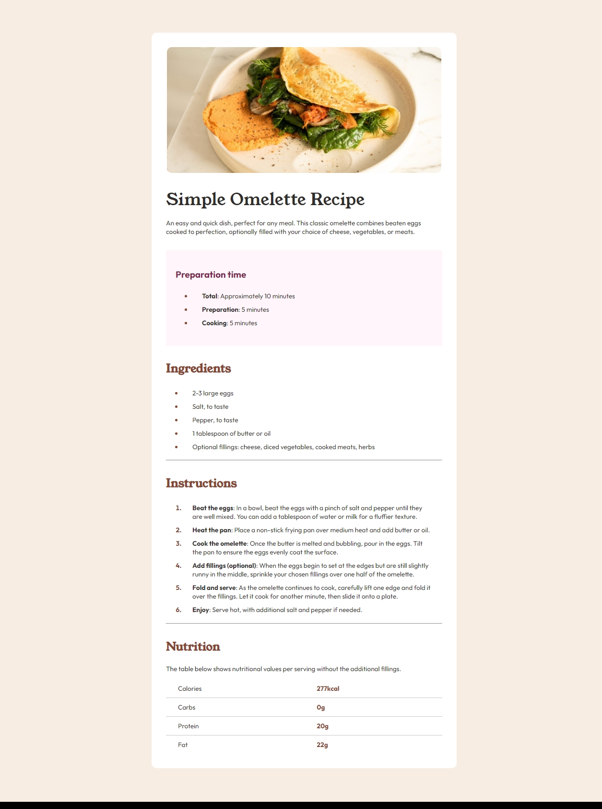

# Frontend Mentor - Recipe page solution

This is a solution to the [Recipe page challenge on Frontend Mentor](https://www.frontendmentor.io/challenges/recipe-page-KiTsR8QQKm). Frontend Mentor challenges help you improve your coding skills by building realistic projects.

## Table of contents

- [Overview](#overview)
  - [Screenshot](#screenshot)
  - [Links](#links)
- [My process](#my-process)
  - [Built with](#built-with)
  - [What I learned](#what-i-learned)
  - [Continued development](#continued-development)
  - [Useful resources](#useful-resources)
- [Author](#author)

## Overview

Recipe Page Project for FrontEnd Mentor

### Screenshot

### Links

- Solution URL: [Add solution URL here](https://your-solution-url.com)
- Live Site URL: https://ninjablacksox2020.github.io/frontend-mentor-recipe-page/

## My process

First I went through the html and used semantic html where I could, and then gave the elements classes and markups where it made sense. Then I worked through the css, first positioning the elements within the page, then working on colors and fonts. Lastly I made the changes for the different screen sizes.

### Built with

- Semantic HTML5 markup
- CSS custom properties
- Flexbox

### What I learned

More about changing the css depending on the size of the screen

@media only screen and (max-width: 600px) {
.main-content {
width: 100%;
margin: 0;
border-radius: 0;
}

    .header img {
        width: 100%;
        margin: 0;
        border-radius: 0;
    }

and ways to change individual parts of the elements

table tr td:nth-child(2) {
color: hsl(14, 45%, 36%);
font-weight: bold;
}

.article-nutrition tr:not(:last-child) {
border-bottom: 1px solid hsl(0, 0%, 79%);
}

### Continued development

I need to learn how to think more programmatically about my css, removing redundancies and using variables to make the code easier to read.

### Useful resources

https://www.w3schools.com/ Great for CSS particulars

## Author

- Website -= https://github.com/ninjablacksox2020/frontend-mentor-recipe-page
- Frontend Mentor - https://www.frontendmentor.io/profile/ninjablacksox2020
